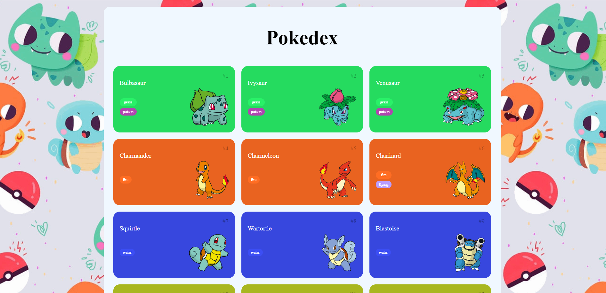

<h1 align="center">
🧧 Pokédex
</h1>

## 📁Sobre o projeto
Projeto de uma Pokedex, utilizando de recursos da API [`pokeapi.co`](https://pokeapi.co/) com requisições feitas através de `fetch API`. Esse projeto foi desenvolvido e evoluído por mim, durante a Formação de Desenvolvimento Frontend com Angular.

Este é um site que funciona como uma pokédex, ele exibe as seguintes informações sobre 150 Pokémons diferentes:
- Imagem
- Nome
- Tipo
- Numero

Para a obter as informações do nome, tipo e imagem do Pokémon foi utilizada a API do "PokéAPI".

Cada Pokémon é exibido em um card na tela, esse card tem sua cor de fundo definida de acordo com o tipo de Pokémon que ele exibe, por exemplo, os Pokémons de tipo "water" tem a cor de fundo do card azul, já os do tipo "poison" a cor é verde.

## 🧑‍💻 Tecnologias usadas:

- 
- `
- 

## 📁resultado

